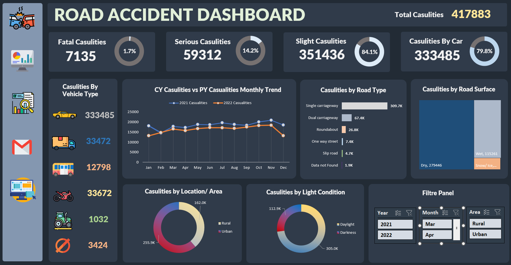
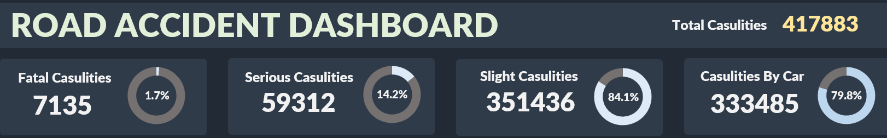
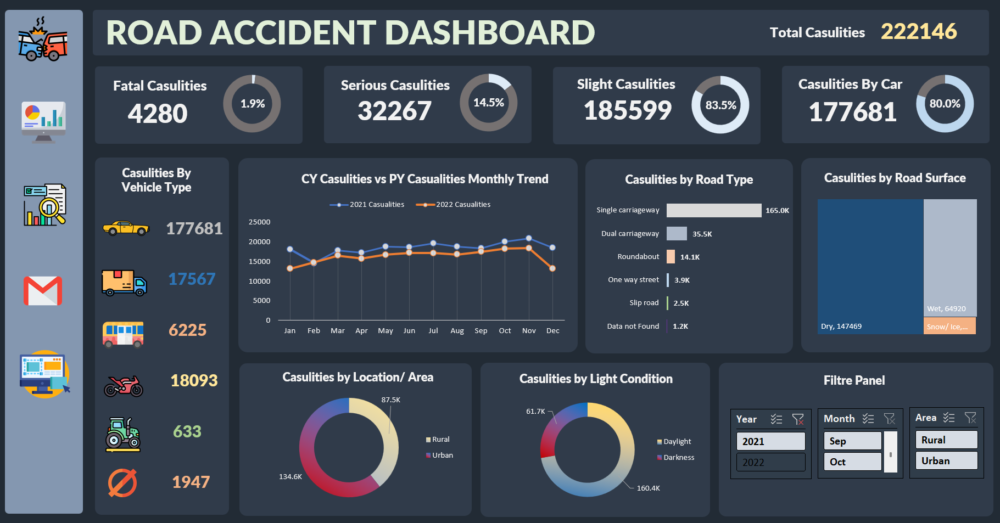
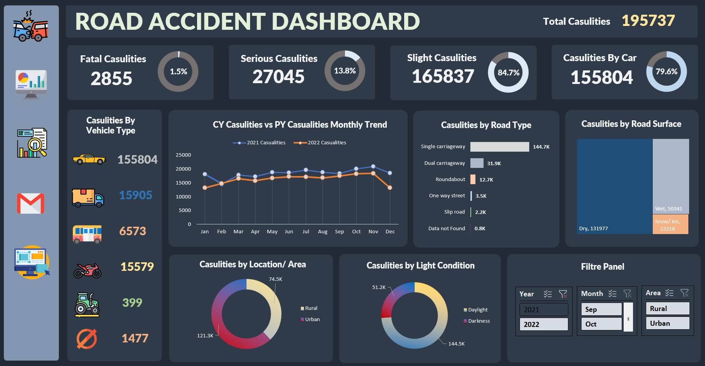

# Road Accident Data Analysis Dashboard

## 1. Background and Overview
Road accidents remain a critical public health and safety challenge. This project delves into a comprehensive analysis of road accident data from Great Britain spanning 2021 and 2022. By meticulously examining these data, we aim to uncover crucial insights that will empower key stakeholders – the Ministry of Transport, Police Force, Emergency Services, and the broader public – to implement data-driven strategies for enhanced road safety.

---

## 2. Data Structure Overview

| Attribute | Description |
|---|---|
| Accident_Index | Unique identifier for each accident record. |
| Accident_Date, Accident_Month, Accident_Year | Temporal information detailing the date, month, and year of the accident occurrence. |
| Day_of_Week | The specific day of the week when the accident took place. |
| Junction_Control, Junction_Detail | Details about the junction where the accident occurred, including its type and specific features. | 
| Accident_Severity | Categorical variable indicating the severity level of the accident (e.g., Slight, Serious, Fatal). |
| Latitude, Longitude | Geospatial coordinates pinpointing the accident location. |
| Light_Conditions | Describes the prevailing lighting conditions at the time of the accident. |
| Local_Authority_(District) | Identifies the local administrative district responsible for the area. |
| Carriageway_Hazards | Details any hazards present on the carriageway. |
| Number_of_Casualties | Indicates the total number of casualties resulting from the accident. |
| Number_of_Vehicles | Specifies the number of vehicles directly involved in the accident. |
| Police_Force | Identifies the police force with jurisdiction over the area. |
| Road_Surface_Conditions, Road_Type, Speed_limit | Attributes describing the characteristics of the road. |
| Time | The specific time of day when the accident occurred. |
| Urban_or_Rural_Area | Indicates whether the accident happened in an urban or rural area. |
| Weather_Conditions | Describes the prevailing weather conditions during the accident. |
| Vehicle_Type | Specifies the type of vehicles involved in the accident. |

---

## 3. Executive Summary
This dashboard focuses on understanding road accidents from 2021 and 2022, using key metrics such as total casualties, accident severity, and vehicle types involved. Insights provide actionable information on:
1. Total casualties and their distribution by severity and vehicle type.
2. Monthly trends in accident conditions.
3. Environmental and situational factors contributing to accidents.

### Excel Dashboard Preview

---

## 4. Insights Deep Dive
### **1) Overall Insights**:
- **Total Casualties**: **417,883**
- Key Factors:
  - **Road Type**: Single carriageways account for ~309k casualties.
  - **Road Surface**: Predominantly on dry surfaces.
  - **Lighting**: Most accidents occur during daylight.
  - **Area**: Urban areas see higher casualties.
- **Vehicle Vulnerability**: Cars contribute **79.8%** of casualties.
- **Injury Severity**: **Slight injuries** account for **84.1%** of cases.

### Overall Insight

### **2) 2021 Insights**:
- **Total Casualties**: **222,146**
- Key Factors:
  - Cars are the most vulnerable, leading to **80%** of casualties.
  - Slight injuries comprise **83.5%** of total casualties.
  - Other factors mirror overall trends (dry roads, daylight, urban areas).

### 2021 Insight

### **3) 2022 Insights**:
- **Total Casualties**: **195,737**
- Key Factors:
  - Cars again contribute **79.6%** of casualties.
  - Slight injuries increase to **84.7%** of cases.
  - Other environmental conditions remain consistent.

### 2022 Insight

### **4) Monthly Analysis**:
- **January**: Wet surfaces dominate.
- **February - June**: Predominantly dry surfaces.
- **July - October**: Combination of dry and wet surfaces, with wet contributing marginally.
- **November**: Wet surfaces dominate, with medium dry and small snow/ice contributions.
- **December**: Wet and snow/ice surfaces (medium) dominate, with smaller dry contributions.

---

## 5. Recommendations
### **For Road Infrastructure**:
1. Enhance safety measures on single carriageways, including speed limit enforcement and lane expansions.
2. Improve drainage systems to manage wet surfaces effectively, especially during monsoon months.

### **For Policy & Awareness**:
1. Targeted safety campaigns for car drivers, focusing on defensive driving techniques.
2. Strengthen penalties for reckless driving in urban areas.

### **For Emergency Services**:
1. Strategically allocate resources to urban accident hotspots.
2. Implement real-time monitoring for quicker accident response.

---

## 7. Visualizations and Filters
### **Visualizations Used**:
1. **Donut Chart**:
   - Visualizes the distribution of casualties by accident severity.
2. **Line Chart**:
   - Tracks monthly trends in accidents and casualties.
3. **Tree Map**:
   - Depicts casualties by road surface.
4. **Pivot Tables**:
   - Dynamic exploration of casualties across dimensions such as year, vehicle type, and road type.

### **Filters Included**:
- **Year**: 2021, 2022.
- **Month**: Jan, Feb,...Dec.
- **Area**: Urban or Rural.

---

## 6. Conclusion
The analysis highlights the significant role of single carriageways, urban areas, and cars in road casualties. By addressing these factors, stakeholders can reduce accident rates and casualties effectively. Seasonal trends also underscore the importance of proactive measures during monsoon and winter months.
